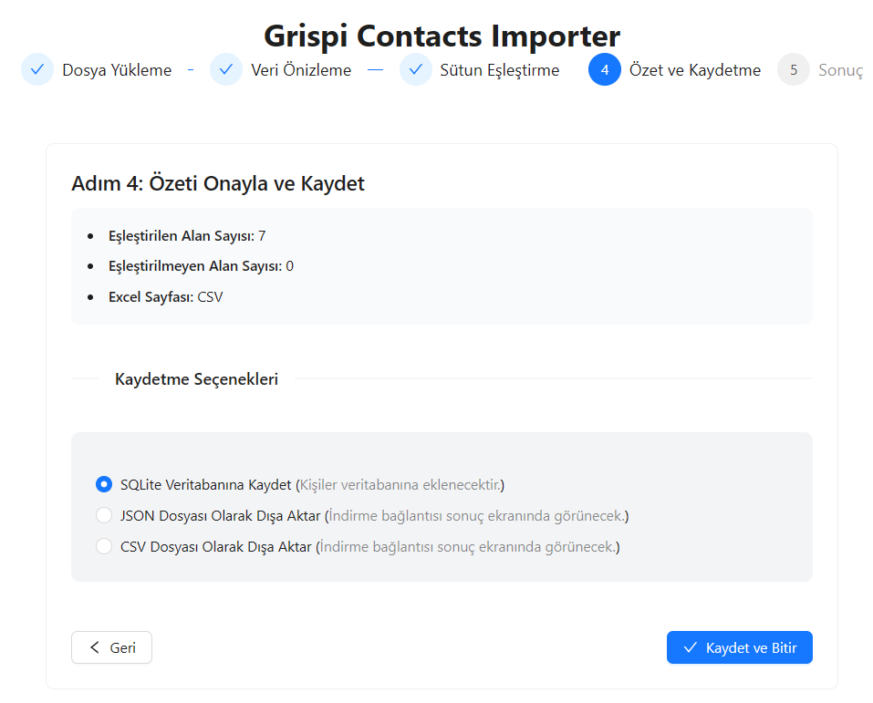

# Grispi Contacts Importer

Bu proje, farklı Excel dosyalarındaki kontak bilgilerini Grispi sisteminde kullanılan standart contact şablonuna dönüştürebilecek bir import aracıdır. Kullanıcıların ellerindeki verileri kolayca sisteme entegre edebilmesini sağlar.

## Özellikler
- Excel/CSV dosyası yükleme (.xlsx, .xls, .csv)
- İlk birkaç satırı önizleme (sheet seçimi desteği)
- Dinamik sütun eşleştirme (Ad, Soyad, E-posta, Telefon vb.)
- Eşleştirme şablonlarını kaydetme ve yeniden kullanma
- Verileri Grispi formatına dönüştürme
- SQLite veri tabanında saklama veya JSON olarak dışa aktarma
- Import durumu ve raporları takip etme

## Uygulama Görselleri

###


### CSV Yükleme


### Yükleme Ekranı


### Ön İzleme


### Eşleme Ekranı

### Kayıt İşlemi


### Sonuç Ekranı

## Teknolojiler

**Backend:**
- Python 3.10+
- FastAPI
- Pandas, OpenPyXL
- SQLite + SQLAlchemy 2.0
- Uvicorn

**Frontend:***
- React 18 
- Ant Design + Tailwind CSS
- Axios, React Router

## Kurulum ve Çalıştırma

### Backend Kurulumu

```bash
cd backend
python -m venv venv
venv\Scripts\activate  
pip install -r requirements.txt

uvicorn main:app --reload --host 0.0.0.0 --port 8000
```

### Frontend Kurulumu

```bash
cd frontend
npm install

npm start
```

## API Endpoints

| Endpoint             | Method | Açıklama                                                     |
|----------------------|--------|--------------------------------------------------------------|
| `/`                  | GET    | API bilgisi ve mevcut endpointler                            |
| `/health`            | GET    | Sistem sağlık kontrolü                                       |
| `/upload`            | POST   | Dosya yükleme ve önizleme (job oluşturur)                    |
| `/preview/{job_id}`  | GET    | Yüklenen dosya için sheet/kolon/örnek satır önizlemesi       |
| `/templates`         | GET    | Kaydedilen eşleştirme şablonlarını listeleme                 |
| `/templates`         | POST   | Yeni şablon oluşturma                                        |
| `/templates/fields`  | GET    | Standart alan listesini döner (contact/ticket/organization)  |
| `/suggest-mapping`   | POST   | Sütun isimlerine göre otomatik eşleştirme önerisi            |
| `/transform/{job_id}`| POST   | Eşleştirmeyi uygular, rapor üretir, JSON/SQLite kaydı yapar  |
| `/jobs/{job_id}`     | GET    | Import job durum/özet bilgisi                                |
| `/contacts`          | GET    | İçeri aktarılan kontakları listeleme                         |


# grispi_contacts_importer
